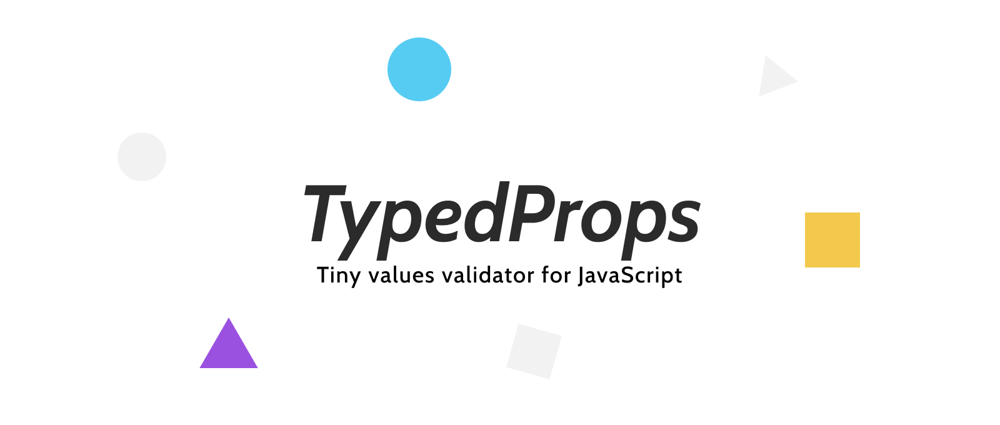

---

[](https://npmjs.com/package/typed-props)
[](https://travis-ci.org/rumkin/typed-props)


[](https://npmjs.com/package/typed-props)

Facebook's PropTypes-alike interface implementation for client and server, reusable
and extensible. It produce error reports instead of throwing or printing into
console. It works *without React*.

[Gitter](https://gitter.im/TypedProps)

## Table of Contents

- [Installation](#installation)
- [Usage](#usage)
- [Examples](#examples)
- [Standard checks](#standard-checks)
- [Non-standard checks](#non-standard-checks)
- [Decorators](#decorators)
- [Checks and groups](#checks-and-groups)
- [Extension](#extension)
- [API](#api)
- [License](#license)

## Installation

Via npm:
```shell
npm i typed-props
```

Or via unpkg.com:

```html
<script src="https://unpkg.com/typed-props@1/dist/typed-props.js"></script>
<script src="https://unpkg.com/typed-props@1/dist/typed-props.min.js"></script>
```

Complete [usage guide](https://github.com/rumkin/typed-props/tree/master/doc).

## Usage

Custom types check:

```javascript

import {Type as T, StrictType as ST, check} from 'typed-props'

const type = T.shape({
  id: T.number.isRequired,
  name: T.string.isRequired,
  email: T.string,
}).isRequired

// Or

const type = ST.shape({
  id: ST.number,
  name: ST.string,
  email: ST.string.optional,
})

const data = {
  id: '1',
  name: null
}

const issues = check(data, type)
```

### Output

Result of validation is an Array of Issues. Issue is an object which describes
validator rules violation. 

Issue typing:
```typescript
export type Issue = {
  rule: string
  path: Array<string|number>
  details: {
    reason: string
    [key:string]: any
  }
}
```

Example:

```javascript
[
  {
    // Violated rule.
    rule: 'type',
    // Value location. It helps to receive value from nested object.
    path: ['user', 'messages', 0],
    // Details explain what exactly goes wrong.
    details: {
      // Reason helps to identify kind of problem within one validator.
      // Usual values are mismatch, no_matches, and redundant.
      reason: 'mismatch',
      // The next values are validator dependent.
      type: 'string',
      expect: true,
      is: false,
    }
  }
]
```

## Examples

* Create [UniqItems check](examples/uniq-items.js).
* [Describe API](examples/api.js) with TypedProps (with circular types resolution).

## Standard checks

Standard checks provided by Facebook's PropTypes:

```javascript
import {Type} from 'typed-props'

// Object properties should pass all checks.
const shape = Type.shape({
  // Any value except of undefined
  anything: Type.isRequired,
  // Which is equivalent of
  anythingElse: Type.any.isRequired,
  // Number property
  number: Type.number,
  // String property
  string: Type.string,
  // Boolean property
  bool: Type.bool,
  // Object property
  object: Type.object,
  // Array property
  array: Type.array,
  // Array property
  func: Type.func,
  // Symbol property
  symbol: Type.symbol,
  // Property which value is instance of Date
  instanceOf: Type.instanceOf(Date),

  // Complex rules

  // One of check if value is in list of passed primitives
  // It works like an enum
  oneOf: ['one', 'two'],
  // Check if all array values match the passed TypedProps
  arrayOf: Type.number,
  // Check if value is matched any of passed TypedProps.
  oneOfType: Type.oneOfType([
    Type.number,
    Type.string,
  ]),
  // Check if all object properties passes the TypedProps.
  objectOf: Type.objectOf(Type.number),
  // Check shape has described properties and no other props.
  exactShape: Type.exact({
    id: Type.number,
    name: Type.string,
  }),
})

const issues = check({}, shape) // => [{path:['anything'], rule: 'isRequired', details: {is: false}}]
```

Result of `check` call is array of [issues](#issue-type). If there is no issues, this array will be
empty.

> ⚠️ If shape/exact rule property presented by function it should return type to check.

> ⚠️ .object will fail for arrays and vice versa.

## Non-standard checks

```javascript
Type.shape({
  // Make type optional
  optionalValue: Type.optional,
  // Determine type in runtime
  propertyDependentType: Type.select(
    [
      ({type}) => type === 'ADD_TODO',
      Type.shape({/* ADD_TODO action payload shape */}),
    ],
    [
      ({type}) => type === 'SET_COMPLETED',
      Type.shape({/* SET_COMPLETED action payload shape */}),
    ],
    [
      () => true,
      Type.any
    ],
  ),
  // Create custom checks when TypedProps is not enough.
  customValue: Type.custom((value) => value === Math.PI),
})
```

TypedProps have it's own custom checks which make it more handful.

### `Checkable.optional`

This is pseudo check. This rule allows to make some property optional. It can
switch off previously defined `.isRequired` check. It's better to use with `StrictType`.

```javascript
StrictType.number.optional
```

### `Checkable.is()`
```
(value:*) -> Checkable
```

This check validates the checkable value to strict equal `value` argument.

```javascript
Type.is('user')
```

### `Checkable.select()`
```
(...Function|Checkable) -> Checkable
```

This checker allow to dynamically switch between types depending on input value.
It selects the first arguments that is not a function or if it's function and
it returns something truly. Then use it as type to check.

```javascript
Type.select(
  [(value) => (typeof value === 'string'), Type.string],
  [(value) => (typeof value === 'number'), Type.number],
  [() => true, Type.any] // Otherwise accept anything
)
```

### `Checkable.custom()`
```
(check:(it:*) -> bool) -> Checkable
```

Custom check accepts `check` argument and use it to validate the value.

## Decorators

__Experimental Feature__. Decorators can check function arguments and value it returns in runtime.

> ⚠️ Decorators throw CheckError with `issues` property.

```javascript
import {StrictType as T, args, result} from 'typed-props'

class Arith {
  // Fixed arguments length example
  @args(T.number, T.number)
  @result(T.number)
  add(a, b) {
    return a + b
  }

  // Variadic argument's length example
  @args(T.number, [T.number])
  @result(T.number)
  addAll(a = 0, ...numbers) {
    return numbers.reduce((sum, b) => sum + b, a)
  }
}
```

## Checks and groups

Currently there are several groups of checkers: existence, type, exact, and complex checks.

* Existance:
  * isRequired
  * optional: removes isRequired
* Type:
  * bool
  * number
  * string
  * func
  * object
  * array
  * any: removes any other type check
* Exact:
  * is
  * oneOf
* Complex:
  * oneOfType
  * arrayOf: overwirites type check with `array`
  * objectOf: overwirites type check with `object`
  * shape: replaces exact
  * exact: replaces shape
  * select
  * custom

Type and existence checks are switchable and can replace each other. It's made
for flexibility.

```javascript
Type.isRequired.number.string.func // -> final check is "required function".
```

In the same time the complex checks like `shape` or `arrayOf` require the input value to has certain
type object and array respectively. They will overwrite type checks too. But overwiting of complex types
currently isn't possible because of unexpected behaviour. It could leads to runtime errors.
So it strongly recommended not to overwrite such checks.

It could be changed in the future.

```javascript
Type.arrayOf(Type.number).isRequired.number // Will throw an error in runtime
```

## Extension

TypedProps support extension throught inheritance. So you can create new type using
`extend` on Type class or mixing in new rules with `Object.defineProperty`.
More real life example is in repository [examples](./examples) directory.

```javascript
class IsFinite extends SimpleRule {
  static ruleName = 'isFinite'

  static checkIt(it) {
    return isFinite(it)
  }
}

class MyTypes extends Type {
  static get isFinite() {
    return new this([
      IsFinite.create([], isFinite.config(true))
    ])
  }

  get isFinite() {
    return new this.constructor(
      isFinite.create(
        this.getChecks(),
        isFinite.config(true),
      )
    )
  }
}
// Mixin into TypedProps
Object.defineProperty(Type, 'isFinite', {
    get() {
        return new this(
            IsFinite.create([], IsFinite.config())
        )
    },
})

Object.define(Type.prototype, 'isFinite', {
  get() {
    const checks = IsFinite.create(
      this.getChecks(), IsFinite.config()
    )
    return new this.constructor(checks)
  },
})
```

### Rule types

There is several Rules which are using internally. 

#### UniqRule

This is probably the most useful type. This rule overwrites any other
occurencies of the rule in type's rules array. It defines it's own
`create` method which shouldn't be overriden by custom implementation. Mostly
because it senseless.

#### SimpleRule

This rule extends `UniqRule` and define it's own `check` method which take all
work by creating non-check logic (issue createsion, result comparision). It
requires `ckeckIt` method wich should return `boolean` value.

```javascript
class IsArray extends SimpleRule {
    static ruleName = 'isArray'

    static checkIt(it) {
        return Array.isArray(it)
    }
}
```

## API

### `Checkable()`

Checkable is a prototype of TypeProps. It contains only check logic and has no own rules.

### `Checkable#getChecks()`
```
() -> Checks[]
```

Returns a list of all defined checks from the TypedProps instance.

### `check()`
```text
(value:*, type:Checkable) -> Array.<Issue>
```

Validate `value` to satisfy `type` requirements. Always produce an Array of Issues.

### `getRuleParams()`

```text
(type:TypedProps, name:string) -> null|*[]
```

* `type` - Target type.
* `name` - Rule name.
* `=` Returns check params object or null if rule isn't found.


Receive `rule` params by its' name.

### `listRules()`

```
(type:TypedProps) -> string[]
```

* `type` - Target type.
* `=` Returns list of rule name in order they were defined.

### `Rule{}`
```
{
    ruleName: string
    config: (...args[]) -> RuleParams
    create: (options:Array.<Check>, params:RuleParams) -> Array.<Check>
    check: (it:*, params:RuleParams, self:Checkable) -> Array.<Issue>
}
```

Rule is an object which contains several methods required for TypeProps to work:

#### `Rule.config()`
```
(...args:*) -> Object
```

Receives arguments from call and transform them to Rule internal representation.
This representation could be different from rule to rule.

#### `Rule.create()`
```
(checks:Check[], params:object) -> Checks[]
```

Adds new check into array of already existing checks. It can overwrite
any rule defined earlier when it is necessary. Also it can modify a rule
defined previously. But in most cases it just remove previously defined rule
and push new one to the end.

#### `Rule.check()`
```
CheckFunction
```

Receives `value` and checks that value is satisfying rule logic with `params`. If it's
not, then method returns list of found issues.

### `Issue{}`
```text
{
  path: Array.<String|Number>
  rule: String
  details: Object
}
```

### `Check{}`
```
{
  rule: String,
  params: Object
  check: CheckFunction
}
```

### `CheckFunction()`
```
(value:*, params:Object) -> Issue[]
```

Object representing validation failure.

### License

Copyright &copy; 2018–2019, Rumkin. Released under [MIT License](LICENSE).
